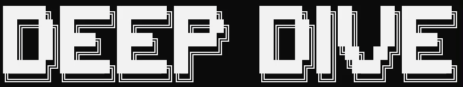
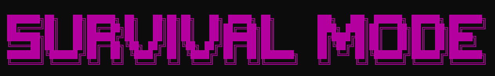
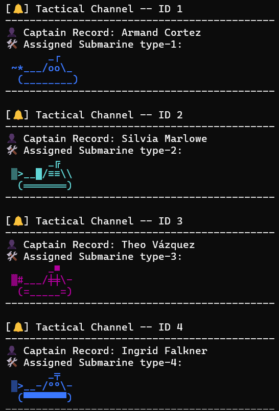
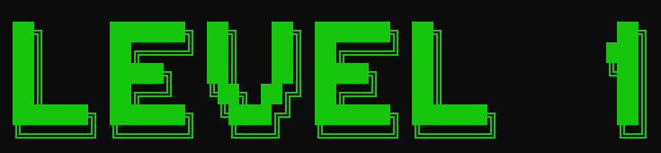
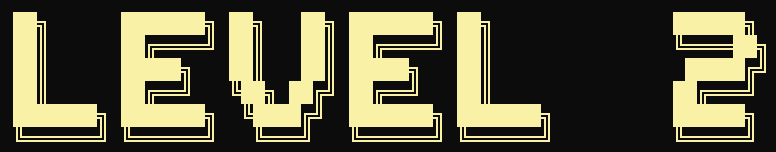
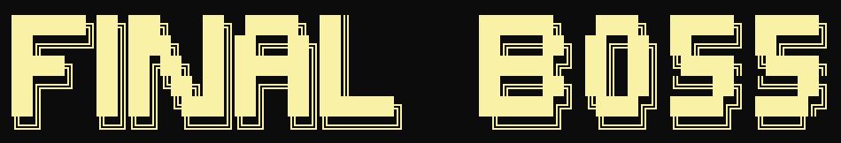
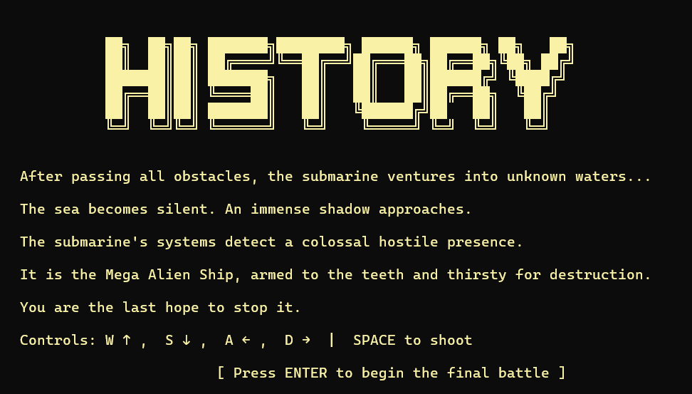

# 🌊 DeepDive:



> Un proyecto del equipo **AlgorithMinds**, desarrollado con pasión bajo el sello de **AlgorithTech**  
> 🧠 *"Impulsamos el futuro con cada línea de pensamiento"*

---

## 🎮 Descripción del juego

**DeepDive** es un videojuego de consola hecho en **C++**, donde asumes el rol de un comandante de submarino en una peligrosa misión bajo el mar.  
Lucha por sobrevivir, esquivar obstáculos, eliminar enemigos y escoltar a tu valioso aliado: un pez que necesita protección.
Con animaciones ASCII, niveles progresivos y mecánicas fluidas, DeepDive te sumerge en una experiencia de código y estrategia.

Consiste en un videojuego desarrollado en C++ que se ejecuta exclusivamente en consola. El Jugador controla un submarino que debe esquivar obstáculos como peces y rocas mientras avanza bajo el mar. El juego se maneja mediante menús interactivos y el uso del teclado expecíficamente con las teclas **(W,A,S,D)** para moverse.

Los obstáculos se generaran aleatoriamente usando estructuras y la funcion rand(), y el submarino tiene un sistemas de vidas que le permite resistir varios impactos antes de perder. La interfaz gráfica se basa en caracteres ASCII, y se usa la función kbhit() de la librería conio.h para detectar las teclas presionadas.

Además, se guarda un récord de distancia recorrida en un archivo de texto, permitiendo llevar un seguimiento del progreso del jugador!!!.

---

## 🚀 Características principales

- ✅ Submarino animado con controles personalizados
- ✅ Movimiento libre en la consola usando `gotoxy`
- ✅ Peces enemigos con animación de múltiples frames
- ✅ Cohetes ofensivos y detección de colisiones
- ✅ Bordes protegidos: no traspasa los límites del mapa
- ✅ Modo historia con 3 niveles únicos:

---

<details>
  <summary>🧱 <strong>Supervivencia</strong> </summary>
  <ul>
    <li>Sobrevive a oleadas de peces enemigos que aparecen de manera aleatoria.</li>
    <li>La dificultad aumenta con el tiempo: enemigos más rápidos y en mayor cantidad.</li>
    <li>Perfecto para practicar y mejorar tus habilidades antes de los niveles principales.</li>
    <li>Puedes ir viendo tu tiempo para mejorar poco a poco!!</li>
  </ul>

  
  **En este asombroso modo puedes eligir a tu gusto uno de los 4 submarinos!!**
  
</details>


---

<details>
  <summary>🐟 <strong>Nivel 1: Recupera las piezas</strong></summary>
  <ul>
    <li>Explora el fondo marino para encontrar piezas esenciales que te permitirán rellenar el oxígeno del submarino.</li>
    <li>Enfréntate a peces guardianes que custodian cada una de las piezas.</li>
    <li>Ten cuidado!! Hay Piezas con formas extrañas(Podrian ser peces).</li>
  </ul>

  
</details>

---

<details>
  <summary>🔱 <strong>Nivel 2: Defensa y escolta</strong></summary>
  <ul>
    <li>Tu misión es proteger y escoltar a un pez aliado a través de un territorio peligroso.</li>
    <li>El trayecto incluye zonas con corrientes marinas que afectan el movimiento.</li>
    <li>Coordina tus movimientos y ataques para sobrevivir juntos hasta el final del nivel.</li>
    <li>No dejes que devoren al pez aliado!!!</li>
  </ul>

  
</details>

---

<details>
  <summary>⚓ <strong>Nivel 3: Jefe final</strong></summary>
  <ul>
    <li>Enfréntate a un temible jefe marino con patrones de ataque únicos.</li>
    <li>Aprovecha los cohetes y tu destreza para esquivar ataques especiales.</li>
    <li>El escenario cuenta con elementos interactivos que puedes usar a tu favor.</li>
    <li>¡Derrota al jefe para completar la aventura y salvar el océano!</li>
  </ul>

  


</details>


---

## 🔧 Sistema modular del juego DeepDive

<details>
  <summary>📦 Estructura general de los módulos</summary>

DeepDive está organizado de manera modular, con archivos `.h` y `.cpp` separados por función. Esto permite escalar el juego fácilmente, mantener el orden y facilitar el mantenimiento.

### 📁 Archivos clave

#### `submarine.h`

Encargado de toda la lógica del submarino:

* `PaintSubmarine(...)`: Pinta diferentes submarinos en consola con arte ASCII.
* `DeleteSubmarine(...)`: Borra el submarino al moverse.
* `MoveSubmarine(...)`: Mueve el submarino con las teclas (WASD y flechas).
* `PaintHearts(...)`, `PaintOxygen(...)`: Muestra la vida y oxígeno.
* `DestroySubmarine(...)`: Muestra animaciones de destrucción.
* `CollisionSubmarine(...)`: Efecto visual al recibir daño.

> Submarino representado en múltiples estilos con colores ANSI y caracteres ASCII. Soporta colisiones y animaciones.

---

#### `fish.h`

Define los peces enemigos (y la base del pez aliado):

* `Fish`: Struct con `x, y, frame`.
* `PaintFish(...)`, `ClearFish(...)`, `MoveFish(...)`: Animación y movimiento.
* `CollisionFish(...)`: Detecta choque con el submarino.

> Los peces tienen animación por frames (`<0)))><`, `<°)))><`, `<o)))><`) y se reposicionan al cruzar pantalla.

---

#### `rockets.h`

Controla los proyectiles enemigos:

* `Rocket`: Struct igual que Fish.
* `Paintrocket(...)`, `ClearRocket(...)`, `MoveRocket(...)`: Movimiento horizontal con animación.
* `CollisionRocket(...)`: Impacto contra el submarino.

> Los cohetes avanzan desde la derecha, y causan daño al impactar. También tienen animación propia.

---

#### `menuprincipal.h`

Construye el menú principal interactivo:

* Uso de arte ASCII (`██████╗ ███████╗...`).
* Menú principal y submenú de niveles.
* Animación de título con colores que cambian.
* Salida con arte y barra de carga animada.
* Integración con los niveles: `level1`, `level2`, `level3`, `survival_mode`.

> Interfaz amigable en consola con navegación por flechas y enter, y colores que cambian dinámicamente.

</details>

---

## 🧠 Equipo de desarrollo

👨‍💻 **AlgorithMinds**  
Un equipo de mentes creativas que combinan programación estructurada, lógica algorítmica y diseño visual ASCII para crear experiencias inmersivas desde la terminal.

**Integrantes del Equipo**
**Nombre completo:** Esteban Alejandro Mate Lúe **Carnet:** 00235525
**Nombre completo:** Yukio Alberto Ogawa Urquilla **Carnet:** 00171625
**Nombre completo:** René Alexander Moya Hernández **Carnet:** 00090925
**Nombre completo:** Javier Gerardo Mangandí Izaguirre **Carnet:** 00204125
---

## 🏗️ Tecnologías utilizadas

- Lenguaje: **C++**
- Librerías:
  - `windows.h`
  - `conio.h`
  - `thread`
  - `chrono`
  - `string`
  - `iostream`
- Programación modular: `.h` y `.cpp` bien organizados
- Coordinadas y animación con `gotoxy` y `Sleep()`
- IDE recomendado: Visual Studio, Code::Blocks, Dev-C++

---
## 📖 Manual de Usuario

### 1. Clonar el repositorio

Abre una terminal y ejecuta:

```bash
git clone https://github.com/FDP-01-2025/project-deepdive.git

```

---

### 2. Accede a la carpeta del proyecto

```bash
cd project-deepdive
```

---

### 3. Compilar el proyecto

```bash
g++ -I src/headers main.cpp -o prueba
```

---

### 4. Ejecutar el juego

```bash
.\prueba.exe
```

---

### 5. Requisitos

- **Compilador C/C++** (por ejemplo, `gcc`, `g++` o MinGW en Windows)
- **Terminal** compatible con la salida del juego

---
## 🤝 Créditos
- Desarrollado por AlgorithMinds
- Bajo el sello de AlgorithTech
-**🧠 “Impulsamos el futuro con cada línea de pensamiento”**
---
## 📂 Estructura del proyecto (resumen)
```plaintext
proyect-deepdive
|── .vscode/
|     └──settings.json
|── assets/
|    └──deepdive_logo.gif
|── database/
|   ├── characters.txt
│   └── deepdive_puntajes.txt
├── src/
│   |
│   ├── levels/
│   │   ├── level1.h
│   │   ├── level2.h
│   │   └── level3.h
│   └── headers/
│      ├── fish.h
│      ├── fish_animation.h
│      ├── game_data.h
│      ├── game_limits.h
│      ├── hide_cursor.h
│      ├── input.h
|      ├── invulnerability.h
|      ├── submarine_boss.h
|      ├── menu.h
|      ├── menu_principal.h
|      ├── missiles.h
|      ├── pieces.h
|      ├── possition.h
|      ├── power_item.h
|      ├── rockets.h
|      └── submarine.h    
│ 
|── main.cpp
└── README.md
